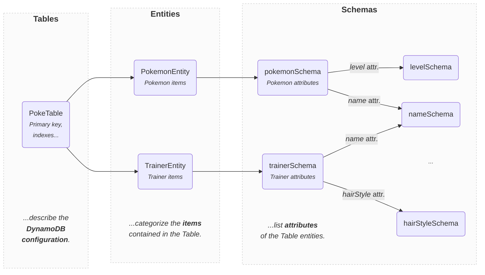

import Mermaid from '@theme/Mermaid';

# Usage

DynamoDB-Toolbox mainly exposes three classes:

- 🏗️ [Tables](../../2-tables/1-usage/index.md) that describe the configuration of your DynamoDB Tables
- 🐶 [Entities](../../3-entities/1-usage/index.md) that categorize the items contained in your Tables
- 📐 [Schemas](../../4-schemas/1-usage/index.md) that list the attributes of your entities



## Instantiation

```ts
import { Table } from 'dynamodb-toolbox/table'
import { Entity } from 'dynamodb-toolbox/entity'
import { schema } from 'dynamodb-toolbox/schema'

// Define a Table
const PokeTable = new Table(...)

// Define an entity
const PokemonEntity = new Entity({
  // Assign it to a table
  table: PokeTable,
  // Specify its schema
  schema: schema(...)
  ...
})
```

An entity must belong to a Table, but the same Table can contain items from several entities. DynamoDB-Toolbox is designed with [Single Tables](https://www.alexdebrie.com/posts/dynamodb-single-table/) in mind, but works just as well with multiple tables, it'll still make your life much easier (batch gets and writes support multiple tables, so we've got you covered).

Once you have defined your `Tables` and `Entities`. You can start using them in combination with [Actions](#methods-vs-actions).

## Methods vs Actions

Queries, updates, transactions, batch operations... DynamoDB has a **wide range of features**. Exposing all of them as distinct methods would **bloat the `Entity` and `Table` classes**. Class methods are not tree-shakable, and why bother bundling the code needed for a feature (which can be quite large) if you don't need it?

Instead, `Tables`, `Entities` and `Schemas` have a single `.build` method which is exactly **1-line long** 🤯 and acts as a gateway to perform [Actions](#how-do-actions-work):

```ts
import { GetItemCommand } from 'dynamodb-toolbox/entity/actions/get'

const { Item } = await PokemonEntity.build(GetItemCommand)
  .key(key)
  .send()
```

DynamoDB operations like the [GetItemCommand](../../3-entities/4-actions/1-get-item/index.md) are instances of actions, but DynamoDB-Toolbox also exposes utility actions, e.g. for [parsing](../../3-entities/4-actions/17-parse/index.md), [formatting](../../3-entities/4-actions/20-format/index.md) or [spying](../../3-entities/4-actions/21-spy/index.md).

The syntax is a bit more verbose than a simple `PokemonEntity.get(key)`, but it allows for **extensibility**, **better code-splitting** and **lighter bundles** while keeping an intuitive **entity-oriented** and **type-inheriting syntax**.

:::info

Notice how the action is imported through a deep import, thanks to the [`exports`](https://nodejs.org/api/packages.html#subpath-exports) field of the `package.json`.

Although all classes and actions are exposed in the main entry path, we recommend using subpaths, and that's what we'll do in the rest of the documentation.

:::

## Aborting an Action

All the actions that use the DocumentClient (like the [GetItemCommand](../../3-entities/4-actions/1-get-item/index.md)) expose an asynchronous `.send()` method to perform the underlying operation.

Any option provided to this method is passed to the DocumentClient. This includes the `abortSignal` option mentioned in the [AWS SDK documentation](https://github.com/aws/aws-sdk-js-v3?tab=readme-ov-file#abortcontroller-example):

```ts
const abortController = new AbortController()
const abortSignal = abortController.signal

const { Item } = await PokemonEntity.build(GetItemCommand)
  .key(key)
  .send({ abortSignal })

// 👇 Aborts the command
abortController.abort()
```

## How do Actions work?

There are three types of actions: [Table Actions](../../2-tables/2-actions/1-scan/index.md), [Entity Actions](../../3-entities/4-actions/1-get-item/index.md) and [Schema Actions](../../4-schemas/16-actions/1-parse.md).

Each type of action is essentially a class that respectively accepts a `Table`, `Entity` or a `Schema` as the first parameter of its constructor, with all other parameters being optional.

For instance, here's the definition of a simple `NameGetter` action that... well, gets the name of an `Entity`:

```ts
import {
  Entity,
  EntityAction
} from 'dynamodb-toolbox/entity'

export class NameGetter<
  ENTITY extends Entity = Entity
> extends EntityAction<ENTITY> {
  constructor(entity: ENTITY) {
    super(entity)
  }

  get(): ENTITY['name'] {
    return this.entity.name
  }
}

const pokeNameGetter = PokemonEntity.build(NameGetter)
// => NameGetter<typeof PokemonEntity>
const pokemonEntityName = pokeNameGetter.get()
// => "POKEMON"
```

`PokemonEntity.build` simply **instanciates a _new_ action** with `PokemonEntity` as the constructor first parameter. Another way to do it would be:

```ts
const pokeNameGetter = new NameGetter(PokemonEntity)
```

Although, we find, this action-oriented syntax is **less readable** than the entity-oriented one, it leads to exactly the same result, so feel free to use it if you prefer!

Here's a comparison of both syntaxes on the [`GetItemCommand`](../../3-entities/4-actions/1-get-item/index.md) action:

```ts
// 👇 Entity-oriented
const { Item } = await PokemonEntity.build(GetItemCommand)
  .key({ pokemonId: 'pikachu1' })
  .options({ consistent: true })
  .send()

// 👇 Action-oriented
const { Item } = await new GetItemCommand(
  PokemonEntity,
  { pokemonId: 'pikachu1' },
  { consistent: true }
).send()
```

<!-- TODO: Add examples next -->
