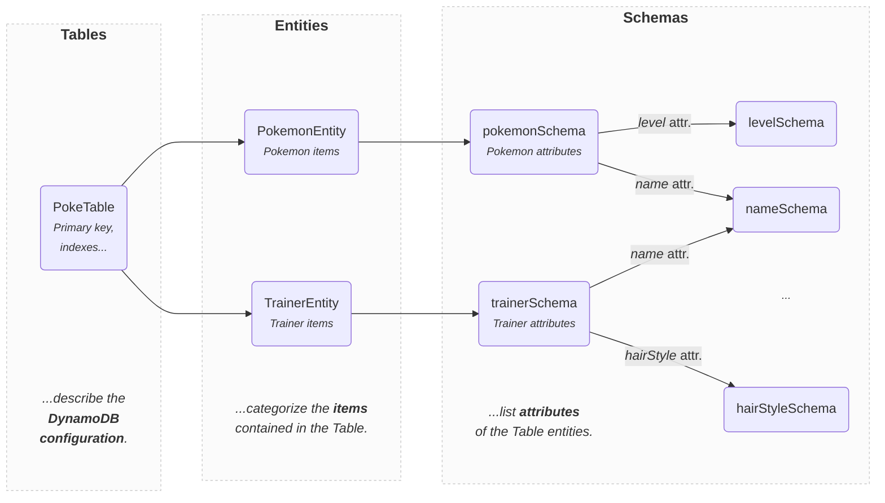

import Mermaid from '@theme/Mermaid';

# Usage

DynamoDB-Toolbox exposes mainly three classes:

- [Tables](../../2-tables/1-usage/index.md) that describe the configuration of your DynamoDB Tables
- [Entities](../../3-entities/1-usage/index.md) that categorize the items contained in your Tables
- [Schemas](../../4-schemas/1-usage/index.md) that list the attributes of your entities



## Instantiation

```ts
import { Table, Entity, schema } from 'dynamodb-toolbox'

// Define a Table
const PokeTable = new Table(...)

// Define an entity
const PokemonEntity = new Entity({
  // Assign it to a table
  table: PokeTable,
  // Specify its schema
  schema: schema(...)
  ...
})
```

An entity must belong to a Table, but the same Table can contain items from several entities. DynamoDB-Toolbox is designed with **Single Tables** in mind, but works just as well with multiple tables, it'll still make your life much easier (`batchGet` and `batchWrite` support multiple tables, so we've got you covered).

Once you have defined your Entities. You can start using them in combination with **Actions**.

## Methods vs Actions

DynamoDB exposes a lot of capabilities (queries, updates, ), which can be quite complex. Bundling that in a single class, bloat. Each interaction in a class method would bloat (typically, UpdateCommands code can be quite long).

The issue with this syntax is that **class methods are not tree-shakable**. Why bother bundling the code of an `.update` method (which can be quite large) if you don't need it?

Instead, `Tables`, `Entities` and `Schemas` have a single `.build` method that is exactly **1-line long** 🤯. It acts as a gateway to perform [Actions](#how-do-actions-work):

```ts
import { GetItemCommand } from 'dynamodb-toolbox/entity/actions/get'

const { Item } = await PokemonEntity.build(GetItemCommand)
  .key(key)
  .send()
```

DynamoDB operations like the [GetItemCommand](../../3-entities/2-actions/1-get-item/index.md) are instances of actions, but DynamoDB-Toolbox also exposes utility actions, e.g. for [parsing](../../3-entities/2-actions/16-parse/index.md) and [formatting](../../3-entities/2-actions/19-format/index.md).

The syntax is a bit more verbose that a simple `PokemonEntity.get(key)`, but it allows for **extensibility**, **better code-splitting** and **lighter bundles** (which is key in the Serverless era) while keeping an intuitive **entity-oriented** and **type-inheriting syntax**.

:::info

Notice how the action is imported through a deep import, thanks to the [`exports` field](https://nodejs.org/api/packages.html#subpath-exports) of the `package.json`, allowing for even better code splitting.

Although all classes and actions are exposed in the main `dynamodb-toolbox` path, it is recommended to use the subpath. That's what we'll use in the rest of the documentation.

:::

## How do Actions work?

There are three types of actions: [Table Actions](../../2-tables/2-actions/1-scan/index.md), [Entity Actions](../../3-entities/2-actions/1-get-item/index.md) and [Schema Actions](../../4-schemas/4-actions/1-parse.md).

Each type of action is essentially a class that respectively accepts a `Table`, `Entity` or a `Schema` as the first parameter of its constructor, with all other parameters being optional.

For instance, here's the definition of a simple `NameGetter` action that... well, gets the name of an `Entity`:

```ts
import {
  Entity,
  EntityAction,
  $entity
} from 'dynamodb-toolbox/entity'

export class NameGetter<
  ENTITY extends Entity = Entity
> extends EntityAction<ENTITY> {
  constructor(entity: ENTITY) {
    super(entity)
  }

  get(): ENTITY['name'] {
    return this[$entity].name
  }
}

const nameGetter = PokemonEntity.build(NameGetter)
// => NameGetter<typeof PokemonEntity>
const pokemonEntityName = nameGetter.get()
// => "POKEMON"
```

As you see, the `.build` methods simply instanciate a new action with its parent as first constructor parameter. Another way to do it would be:

```ts
const nameGetter = new NameGetter(PokemonEntity)
```

Although this action-oriented syntax is (we find) less readable than the entity-oriented one, it leads to exactly the same result! Feel free to use it if you prefer 🙌

Here's a comparison of both syntaxes on the [`GetItemCommand`](/docs/entities/actions/get-item) action:

```ts
// 👇 Entity-oriented
const { Item } = await PokemonEntity.build(GetItemCommand)
  .key({ pokemonId: 'pikachu1' })
  .options({ consistent: true })
  .send()

// 👇 Action-oriented
const { Item } = await new GetItemCommand(
  PokemonEntity,
  { pokemonId: 'pikachu1' },
  { consistent: true }
).send()
```
