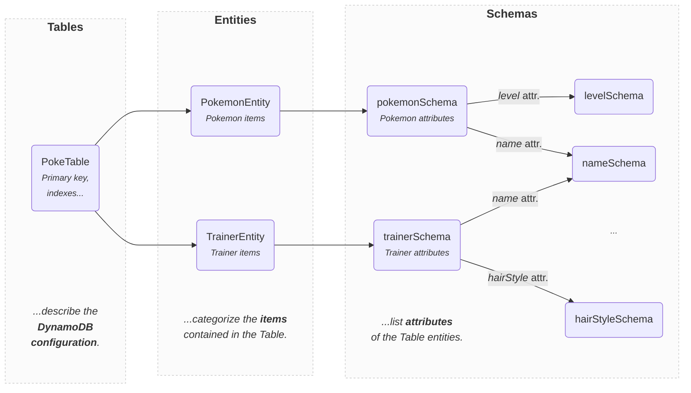

import Mermaid from '@theme/Mermaid';

# Usage

DynamoDB-Toolbox exposes mainly three classes:

- Tables
- Entities
- Schemas

```mermaid
flowchart LR
  classDef mmddescription fill:none,stroke:none,font-style:italic
  classDef mmdcontainer fill:#eee4,stroke-width:1px,stroke-dasharray:3,stroke:#ccc,font-weight:bold,font-size:large
  classDef mmdspace fill:none,stroke:none,color:#0000

  subgraph Tables
    space1( ):::mmdspace
    space2( ):::mmdspace
    pokeTable(PokeTable<br/><i><small>Primary key,<br/>indexes...</small></i>)
    space3( ):::mmdspace
    tableDescription(...describe the<br/><b>DynamoDB<br/>configuration</b>.<br/>):::mmddescription
  end

  Tables:::mmdcontainer

  subgraph Entities
    space4( ):::mmdspace
    pokemonEntity(PokemonEntity<br/><i><small>Pokemon items</small></i>)
    space5( ):::mmdspace
    trainerEntity(TrainerEntity<br/><i><small>Trainer items</small></i>)

    pokeTable --> pokemonEntity
    pokeTable --> trainerEntity

    entitiesDescription(...categorize the <b>items</b><br/>contained in the Table.):::mmddescription
  end


  Entities:::mmdcontainer

  subgraph Schemas
    space6( ):::mmdspace
    pokemonSchema(pokemonSchema<br/><i><small>Pokemon attributes</small></i>)
    trainerSchema(trainerSchema<br/><i><small>Trainer attributes</small></i>)
    levelSchema(levelSchema)
    nameSchema(nameSchema)
    otherSchemas(<small>...</small>):::mmddescription
    hairStyleSchema(hairStyleSchema)
    schemasDescription(...list <b>attributes</b><br/>of the Table entities.):::mmddescription

    pokemonEntity-->pokemonSchema
    trainerEntity-->trainerSchema
    pokemonSchema-- <i>level</i> attr. -->levelSchema
    pokemonSchema-- <i>name</i> attr. -->nameSchema
    trainerSchema-- <i>name</i> attr. -->nameSchema
    trainerSchema-- <i>hairStyle</i> attr. -->hairStyleSchema
    schemasDescription ~~~ hairStyleSchema
  end

  Schemas:::mmdcontainer
```
