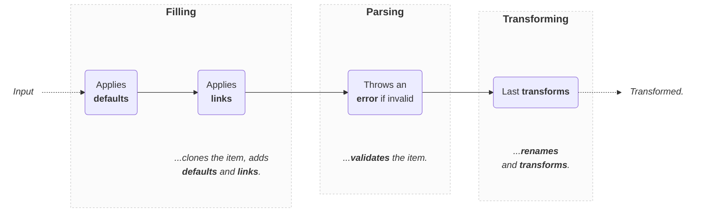

import Tabs from '@theme/Tabs';
import TabItem from '@theme/TabItem';

# EntityParser

Given an input of any type and a mode, validates that it respects the schema of the `Entity` and applies transformations:

```ts
import { EntityParser } from 'dynamodb-toolbox/entity/actions/parse'

const {
  // 👇 Parsed item + Primary key
  item,
  key
} = PokemonEntity.build(EntityParser).parse(input)
```

The default mode is `put`, but you can switch it to `update` or `key` if needed:

```ts
const parsed = PokemonEntity.build(EntityParser).parse(
  keyInput,
  // Additional options
  { mode: 'key' }
)
```

In DynamoDB-Toolbox, parsing is done in **4 steps**:



Note that:

- Additional fields are omitted, but inputs are not mutated
- The mode `defaults` and `links` are applied
- Transformations (i.e. `savedAs` and `transforms`) are applied

The `Table` primary key is derived from the validated input by applying [`computeKey`](../../1-usage/index.md#computekey) if it exists, or extracted from the transformed input otherwise.

:::info

This action is mostly a **wrapper around the schema [`Parser`](../../../4-schemas/16-actions/1-parse.md) action**, so we highly recommend you read its dedicated documentation first.

:::

## Methods

### `parse(...)`

<p style={{ marginTop: '-15px' }}><i><code>(input: unknown, options?: ParseItemOptions) => TransformedItem&lt;ENTITY&gt;</code></i></p>

Parses an input of any type:

<!-- prettier-ignore -->
```ts
const parsed = PokemonEntity.build(EntityParser).parse(input)
```

You can provide **parsing options** as a second argument. Available options:

| Option           |           Type           | Default | Description                                                                                                                      |
| ---------------- | :----------------------: | :-----: | -------------------------------------------------------------------------------------------------------------------------------- |
| `fill`           |        `boolean`         | `true`  | Whether to complete the input (with `defaults` and `links`) prior to validation or not.                                          |
| `mode`           | `put`, `key` or `update` |  `put`  | The mode of the parsing: Impacts which `default` and `link` should be used, as well as requiredness during validation.           |
| `parseExtension` |       _(internal)_       |    -    | Dependency injection required to parse extended syntax (`$get`, `$add` etc.) when using the `update` mode (check example below). |

:::note[Examples]

<Tabs>
<TabItem value="put" label="Put">

<!-- prettier-ignore -->
```ts
const pokemon = {
  pokemonId: 'pikachu1',
  name: 'Pikachu',
  types: ['Electric'],
  ...
}

const parsed = PokemonEntity.build(EntityParser).parse(pokemon)
```

</TabItem>
<TabItem value="key" label="Key">

```ts
const { key } = PokemonEntity.build(EntityParser).parse(
  { pokemonId: 'pikachu1' },
  { mode: 'key' }
)
```

</TabItem>
<TabItem value="update" label="Update">

```ts
const { item } = PokemonEntity.build(EntityParser).parse(
  { pokemonId: 'bulbasaur1', customName: 'PlantyDino' },
  { mode: 'update' }
)
```

</TabItem>
<TabItem value="update-extended" label="Update (extended)">

```ts
import {
  $add,
  parseUpdateExtension
} from 'dynamodb-toolbox/entity/actions/update'

const { item } = PokemonEntity.build(EntityParser).parse(
  // 👇 `$add` is an extension, so `parseExtension`  is needed
  { pokemonId: 'pikachu1', customName: $add(1) },
  { mode: 'update', parseExtension: parseUpdateExtension }
)
```

</TabItem>
</Tabs>

:::

You can use the `TransformedItem` generic type to explicitly type an object as a parsing output object:

```ts
import type { TransformedItem } from 'dynamodb-toolbox/entity'

const transformedItem: TransformedItem<
  typeof PokemonEntity,
  // 👇 Optional options
  { mode: 'key' }
  // ❌ Throws a type error
> = { invalid: 'input' }
```

Note that the `SavedItem` generic is actually based on it:

```ts
import type { SavedItem } from 'dynamodb-toolbox/parse'

const savedItem: SavedItem<typeof PokemonEntity> = {
  pokemonId: '123'
  ...
}
```

### `reparse(...)`

<p style={{ marginTop: '-15px' }}><i><code>(input: InputItem&lt;ENTITY&gt;, options?: ParseItemOptions) => TransformedItem&lt;ENTITY&gt;</code></i></p>

Similar to [`.parse`](#parse), but with the input correctly typed (taking the mode into account) instead of `unknown`:

```ts
PokemonEntity.build(EntityParser)
  // ❌ Throws a type error
  .reparse({ invalid: 'input' })
```

You can use the `InputItem` generic type (or `ValidItem` if `fill` is set to `false`) to explicitly type an object as a parsing input object:

```ts
import type { InputItem } from 'dynamodb-toolbox/entity'

const input: InputItem<
  typeof PokemonEntity,
  // 👇 Optional options
  { mode: 'key' }
  // ❌ Throws a type error
> = { invalid: 'input' }
```

Note that the `KeyInputItem` generic is actually based on it:

```ts
import type { KeyInputItem } from 'dynamodb-toolbox/entity'

const keyInput: KeyInputItem<typeof PokemonEntity> = {
  pokemonId: 'pikachu1'
}
```
