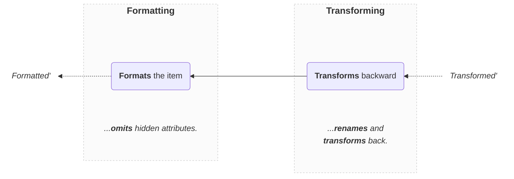

import Tabs from '@theme/Tabs';
import TabItem from '@theme/TabItem';

# EntityFormatter

Given a transformed item, validates that it respects the schema of the `Entity`, applies transformations backward and hide hidden attributes:

```ts
import { EntityFormatter } from 'dynamodb-toolbox/entity/actions/format'

const formattedPikachu =
  PokemonEntity.build(EntityFormatter).format(savedPikachu)
```

In DynamoDB-Toolbox, formatting is done in **2 steps**:



Note that:

- Additional and `hidden` fields are omitted, but inputs are not mutated
- The formatting throws an error if the saved item is invalid
- Transformations (i.e. `savedAs` and `transforms`) are applied backward

:::info

This action is mostly a **wrapper around the schema [`Formatter`](../../../4-schemas/16-actions/2-format.md) action**, so we highly recommend you read its dedicated documentation first.

:::

## Methods

### `format(...)`

<p style={{ marginTop: '-15px' }}><i><code>(savedItem: unknown, options?: FormatItemOptions) => FormattedItem&lt;ENTITY&gt;</code></i></p>

Formats a saved item:

<!-- prettier-ignore -->
```ts
const formattedItem = PokemonEntity.build(EntityFormatter).format(savedItem)
```

You can provide **formatting options** as a second argument. Available options:

| Option       |       Type       | Default | Description                                                                                                                                                                                          |
| ------------ | :--------------: | :-----: | ---------------------------------------------------------------------------------------------------------------------------------------------------------------------------------------------------- |
| `transform`  |    `boolean`     | `true`  | Whether to transform back the input (with `savedAs` and `transform`) prior to formatting or not.                                                                                                     |
| `partial`    |    `boolean`     | `false` | Allow every attribute (flat or deep) to be optional while formatting.                                                                                                                                |
| `attributes` | `Path<Entity>[]` |    -    | To specify a list of attributes to format (other attributes are omitted).<br/><br/>See the [`PathParser`](../19-parse-paths/index.md#paths) action for more details on how to write attribute paths. |

:::note[Examples]

<Tabs>
<TabItem value="partial" label="Partial">

```ts
const saved = {
  pokemonId: 'pikachu1',
  name: 'Pikachu',
  ...
}

// 🙌 Typed as `DeepPartial<Pokemon>`
const formatted = PokemonEntity
  .build(EntityFormatter)
  .format(saved, { partial: true })
```

</TabItem>
<TabItem value="attributes" label="Attributes">

```ts
const saved = {
  pokemonId: 'pikachu1',
  name: 'Pikachu',
  level: 42,
  ...
}

// 🙌 Typed as `Pick<Pokemon, 'name' | 'level'>`
const formatted = PokemonEntity
  .build(EntityFormatter)
  .format(saved, { attributes: ['name', 'level'] })
```

</TabItem>
<TabItem value="formatting-only" label="Formatting only">

```ts
// 👇 Not transformed
const valid = {
  pokemonId: 'pikachu1',
  name: 'Pikachu',
  level: 42,
  ...
}

// 👇 Simply omits hidden attributes
const formatted = PokemonEntity
  .build(EntityFormatter)
  .format(valid, { transform: false })
```

</TabItem>
</Tabs>

:::

You can use the `FormattedItem` type to explicitly type an object as a formatting output object:

```ts
import type { FormattedItem } from 'dynamodb-toolbox/entity'

const formattedItem: FormattedItem<
  typeof PokemonEntity,
  // 👇 Optional options
  { partial: false; attributes: 'name' | 'level' }
  // ❌ Throws a type error
> = { invalid: 'output' }
```
