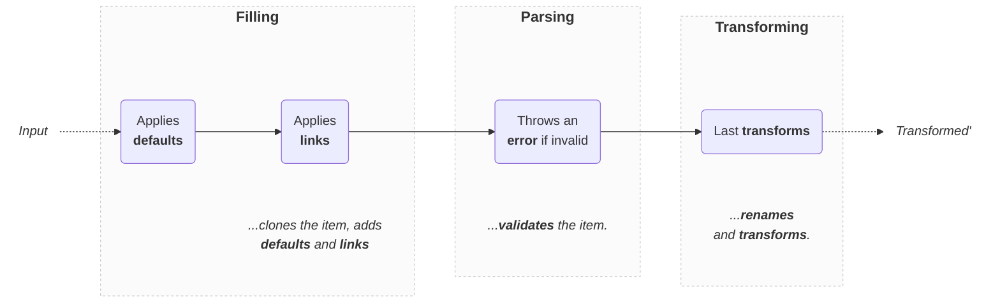

import Tabs from '@theme/Tabs';
import TabItem from '@theme/TabItem';

# Parser

Given an input of any type and a mode, validates that **it respects the schema** and applies transformations:

```ts
import { Parser } from 'dynamodb-toolbox/schema/actions/parse'

const validPokemon = pokemonSchema
  .build(Parser)
  .parse(pokemon)
```

The default mode is `put`, but you can switch it to `update` or `key` if needed:

```ts
const validKey = pokemonSchema.build(Parser).parse(
  key,
  // Additional options
  { mode: 'key' }
)
```

In DynamoDB-Toolbox, parsing is done in **4 steps**:



Note that:

- Additional fields are omitted, but inputs are not mutated
- The mode `defaults` and `links` are applied by default
- Transformations (i.e. `savedAs` and `transforms`) are applied by default

:::note[Example]

Here are **step-by-step** parsing examples:

<details className="details-in-admonition">
<summary>☝️ <b>Schema</b></summary>

```ts
const now = () => new Date().toISOString()

const pokemonSchema = schema({
  // key attributes
  pokemonClass: string()
    .key()
    .transform(prefix('POKEMON'))
    .savedAs('partitionKey'),
  pokemonId: string().key().savedAs('sortKey'),

  // timestamps
  created: string().default(now),
  updated: string()
    .required('always')
    .putDefault(now)
    .updateDefault(now),

  // other attributes
  name: string().optional(),
  level: number().default(1)
}).and(prevSchema => ({
  levelPlusOne: number().link<typeof prevSchema>(
    ({ level }) => level + 1
  )
}))
```

</details>

<details className="details-in-admonition">
<summary>🔎 <b><code>'put'</code> mode</b></summary>

<Tabs>
<TabItem value="input" label="Input">

```diff
{
  "pokemonClass": "pikachu",
  "pokemonId": "123",
  "name": "Pikachu"
}
```

</TabItem>
<TabItem value="defaulted" label="Defaulted">

```diff
{
  "pokemonClass": "pikachu",
  "pokemonId": "123",
+ "created": "2022-01-01T00:00:00.000Z",
+ "modified": "2022-01-01T00:00:00.000Z",
  "name": "Pikachu",
+ "level": 1,
}
```

</TabItem>
<TabItem value="linked" label="Linked">

```diff
{
  "pokemonClass": "pikachu",
  "pokemonId": "123",
  "created": "2022-01-01T00:00:00.000Z",
  "modified": "2022-01-01T00:00:00.000Z",
  "name": "Pikachu",
  "level": 1,
+ "levelPlusOne": 2,
}
```

</TabItem>
<TabItem value="parsed" label="Parsed">

```diff
{
  "pokemonClass": "pikachu",
  "pokemonId": "123",
  "created": "2022-01-01T00:00:00.000Z",
  "modified": "2022-01-01T00:00:00.000Z",
  "name": "Pikachu",
  "level": 1,
  "levelPlusOne": 2,
}
+ Item is valid ✅
```

</TabItem>
<TabItem value="transformed" label="Transformed">

```diff
{
- "pokemonClass": "pikachu",
+ "partitionKey": "POKEMON#pikachu",
- "pokemonId": "123",
+ "sortKey": "123",
  "created": "2022-01-01T00:00:00.000Z",
  "modified": "2022-01-01T00:00:00.000Z",
  "name": "Pikachu",
  "level": 1,
  "levelPlusOne": 2,
}
```

</TabItem>
</Tabs>

</details>

<details className="details-in-admonition">
<summary>🔎 <b><code>'key'</code> mode</b></summary>

<Tabs>
<TabItem value="input" label="Input">

```diff
{
  "pokemonClass": "pikachu",
  "pokemonId": "123",
}
+ (Only key attributes are required)
```

</TabItem>
<TabItem value="defaulted" label="Defaulted">

```diff
{
  "pokemonClass": "pikachu",
  "pokemonId": "123",
}
+ No default to apply ✅
```

</TabItem>
<TabItem value="linked" label="Linked">

```diff
{
  "pokemonClass": "pikachu",
  "pokemonId": "123",
}
+ No link to apply ✅
```

</TabItem>
<TabItem value="parsed" label="Parsed">

```diff
{
  "pokemonClass": "pikachu",
  "pokemonId": "123",
}
+ Item is valid ✅
```

</TabItem>
<TabItem value="transformed" label="Transformed">

```diff
{
- "pokemonClass": "pikachu",
+ "partitionKey": "POKEMON#pikachu",
- "pokemonId": "123",
+ "sortKey": "123",
}
```

</TabItem>
</Tabs>

</details>

<details className="details-in-admonition">
<summary>🔎 <b><code>'update'</code> mode</b></summary>

<Tabs>
<TabItem value="input" label="Input">

```diff
{
  "pokemonClass": "bulbasaur",
  "pokemonId": "123",
  "name": "PlantyDino",
}
```

</TabItem>
<TabItem value="defaulted" label="Defaulted">

```diff
{
  "pokemonClass": "bulbasaur",
  "pokemonId": "123",
+ "modified": "2022-01-01T00:00:00.000Z",
  "name": "PlantyDino",
}
```

</TabItem>
<TabItem value="linked" label="Linked">

```diff
{
  "pokemonClass": "bulbasaur",
  "pokemonId": "123",
  "modified": "2022-01-01T00:00:00.000Z",
  "name": "PlantyDino",
}
+ No updateLink to apply ✅
```

</TabItem>
<TabItem value="parsed" label="Parsed">

```diff
{
  "pokemonClass": "bulbasaur",
  "pokemonId": "123",
  "modified": "2022-01-01T00:00:00.000Z",
  "name": "PlantyDino",
}
+ Item is valid ✅
```

</TabItem>
<TabItem value="transformed" label="Transformed">

```diff
{
- "pokemonClass": "bulbasaur",
+ "partitionKey": "POKEMON#bulbasaur",
- "pokemonId": "123",
+ "sortKey": "123",
  "modified": "2022-01-01T00:00:00.000Z",
  "name": "PlantyDino",
}
```

</TabItem>
</Tabs>

</details>

:::

## Methods

### `parse(...)`

<p style={{ marginTop: '-15px' }}><i><code>(input: unknown, options?: ParseValueOptions) => ParsingResults&lt;SCHEMA&gt;</code></i></p>

Parses an input of any type:

```ts
const parsedValue = pokemonSchema.build(Parser).parse(input)
```

You can provide options as a second argument. Available options:

| Option           |           Type           | Default | Description                                                                                                                      |
| ---------------- | :----------------------: | :-----: | -------------------------------------------------------------------------------------------------------------------------------- |
| `fill`           |        `boolean`         | `true`  | Whether to complete the input (with `defaults` and `links`) prior to validation or not.                                          |
| `transform`      |        `boolean`         | `true`  | Whether to transform the input (with `savedAs` and `transform`) after validation or not.                                         |
| `mode`           | `put`, `key` or `update` |  `put`  | The mode of the parsing: Impacts which `default` and `link` should be used, as well as requiredness during validation.           |
| `parseExtension` |       _(internal)_       |    -    | Dependency injection required to parse extended syntax (`$get`, `$add` etc.) when using the `update` mode (check example below). |

:::note[Examples]

<Tabs>
<TabItem value="put" label="Put">

<!-- prettier-ignore -->
```ts
const pokemon = {
  pokemonId: 'pikachu1',
  name: 'Pikachu',
  types: ['Electric'],
  ...
}

const validPokemon = pokemonSchema.build(Parser).parse(pokemon)
```

</TabItem>
<TabItem value="key" label="Key">

```ts
const validKey = pokemonSchema
  .build(Parser)
  .parse({ pokemonId: 'pikachu1' }, { mode: 'key' })
```

</TabItem>
<TabItem value="update" label="Update">

```ts
const validUpdate = pokemonSchema
  .build(Parser)
  .parse(
    { pokemonId: 'bulbasaur1', customName: 'PlantyDino' },
    { mode: 'update' }
  )
```

</TabItem>
<TabItem value="update-extended" label="Update (extended)">

```ts
import {
  $add,
  parseUpdateExtension
} from 'dynamodb-toolbox/entity/actions/update'

const validUpdate = pokemonSchema.build(Parser).parse(
  // 👇 `$add` is an extension, so `parseExtension`  is needed
  { pokemonId: 'pikachu1', customName: $add(1) },
  { mode: 'update', parseExtension: parseUpdateExtension }
)
```

</TabItem>
</Tabs>

:::

You can use the `TransformedValue` generic type (or `ValidValue` if `transform` is set to `false`) to explicitly type an object as a parsing output object:

```ts
import type { TransformedValue } from 'dynamodb-toolbox/schema'

const parsedKey: TransformedValue<
  typeof pokemonSchema,
  // 👇 Optional options
  { mode: 'key' }
  // ❌ Throws a type error
> = { invalid: 'input' }
```

### `reparse(...)`

<p style={{ marginTop: '-15px' }}><i><code>(input: InputValue&lt;SCHEMA&gt;, options?: ParseValueOptions) => ParsingResults&lt;SCHEMA&gt;</code></i></p>

Similar to [`.parse`](#parse), but with the input correctly typed (taking the mode into account) instead of `unknown`:

```ts
pokemonSchema
  .build(Parser)
  // ❌ Throws a type error
  .reparse({ invalid: 'input' })
```

You can use the `InputValue` generic type (or `ValidValue` if `fill` is set to `false`) to explicitly type an object as a parsing input object:

```ts
import type { InputValue } from 'dynamodb-toolbox/schema'

const keyInput: InputValue<
  typeof pokemonSchema,
  // 👇 Optional options
  { mode: 'key' }
  // ❌ Throws a type error
> = { invalid: 'input' }
```

### `start(...)`

<p style={{ marginTop: '-15px' }}><i><code>(input: unknown, options?: ParseValueOptions) => Generator&lt;ParsingResults&lt;SCHEMA&gt;&gt;</code></i></p>

Similar to [`.parse`](#parse), but returns the underlying [Generator](https://developer.mozilla.org/en-US/docs/Web/JavaScript/Reference/Global_Objects/Generator) to inspect the intermediate results of the parsing steps:

:::note[Examples]

<Tabs>
<TabItem value="complete" label="Complete">

```ts
const parsingGenerator = pokemonSchema
  .build(Parser)
  .start(pokemon)

const defaultedPokemon = parsingGenerator.next().value
const linkedPokemon = parsingGenerator.next().value
const parsedPokemon = parsingGenerator.next().value
const transformedPokemon = parsingGenerator.next().value
```

</TabItem>
<TabItem value="transformed" label="Transformed only">

```ts
const parsingGenerator = pokemonSchema
  .build(Parser)
  .start(pokemon, { fill: false })

// 👇 No `fill` step
const parsedPokemon = parsingGenerator.next().value
const transformedPokemon = parsingGenerator.next().value
```

</TabItem>
<TabItem value="filled" label="Filled only">

```ts
const parsingGenerator = pokemonSchema
  .build(Parser)
  .start(pokemon, { transform: false })

const defaultedPokemon = parsingGenerator.next().value
const linkedPokemon = parsingGenerator.next().value
const parsedPokemon = parsingGenerator.next().value
// 👆 No `transform` step
```

</TabItem>
</Tabs>

:::

### `validate(...)`

<p style={{ marginTop: '-15px' }}><i><code>(input: unknown, options?: ValidationOptions) => boolean</code></i></p>

Runs only the **parsing step** of the parsing workflow on the provided input. Returns `true` if the input is valid, catches any parsing error and returns `false` otherwise:

```ts
const isValid = pokemonSchema.build(Parser).validate(input)
```

Note that `.validate(...)` acts as a [type guard](https://www.typescriptlang.org/docs/handbook/advanced-types.html):

```ts
if (pokemonSchema.build(Parser).validate(input)) {
  // 🙌 Typed as `Pokemon`!
  const { level, name } = input
  ...
}
```

Available options:

| Option           |           Type           | Default | Description                                                                                                                      |
| ---------------- | :----------------------: | :-----: | -------------------------------------------------------------------------------------------------------------------------------- |
| `mode`           | `put`, `key` or `update` |  `put`  | The mode of the parsing: Impacts requiredness during validation.                                                                 |
| `parseExtension` |       _(internal)_       |    -    | Dependency injection required to parse extended syntax (`$get`, `$add` etc.) when using the `update` mode (check example below). |

:::note[Examples]

<Tabs>
<TabItem value="put" label="Put">

<!-- prettier-ignore -->
```ts
const pokemon = {
  pokemonId: 'pikachu1',
  name: 'Pikachu',
  types: ['Electric'],
  ...
}

const isValid = pokemonSchema.build(Parser).validate(pokemon)
```

</TabItem>
<TabItem value="key" label="Key">

```ts
const isValid = pokemonSchema
  .build(Parser)
  .validate({ pokemonId: 'pikachu1' }, { mode: 'key' })
```

</TabItem>
<TabItem value="update" label="Update">

```ts
const isValid = pokemonSchema
  .build(Parser)
  .validate(
    { pokemonId: 'bulbasaur1', customName: 'PlantyDino' },
    { mode: 'update' }
  )
```

</TabItem>
<TabItem value="update-extended" label="Update (extended)">

```ts
import {
  $add,
  parseUpdateExtension
} from 'dynamodb-toolbox/entity/actions/update'

const isValid = pokemonSchema.build(Parser).validate(
  // 👇 `$add` is an extension, so `parseExtension`  is needed
  { pokemonId: 'pikachu1', customName: $add(1) },
  { mode: 'update', parseExtension: parseUpdateExtension }
)
```

</TabItem>
</Tabs>
