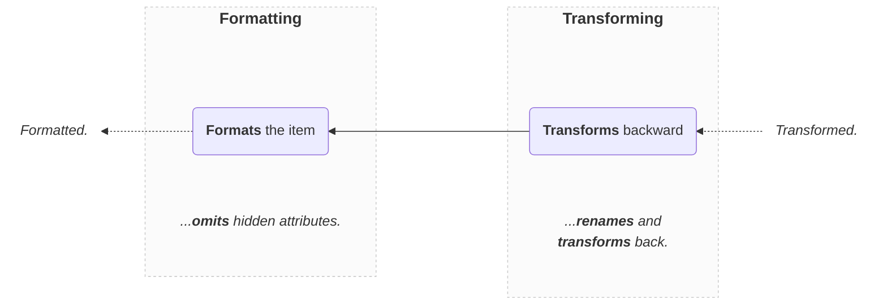

import Tabs from '@theme/Tabs';
import TabItem from '@theme/TabItem';

# Formatter

Given a saved item, validates that **it respects the schema** and formats it:

```ts
import { Formatter } from 'dynamodb-toolbox/schema/actions/format'

const formattedPikachu = pokemonSchema
  .build(Formatter)
  .format(savedPikachu)
```

In DynamoDB-Toolbox, formatting is done in **2 steps**:



Note that:

- Additional and `hidden` fields are omitted, but inputs are not mutated
- The formatting throws an error if the saved item is invalid
- Transformations (i.e. `savedAs` and `transforms`) are applied (backward) by default

## Methods

### `format(...)`

<p style={{ marginTop: '-15px' }}><i><code>(savedValue: unknown, options?: FormatValueOptions) => FormattedValue&lt;SCHEMA&gt;</code></i></p>

Formats a saved item:

<!-- prettier-ignore -->
```ts
const formattedValue = pokemonSchema.build(Formatter).format(savedValue)
```

You can provide **formatting options** as a second argument. Available options:

| Option       |       Type       | Default | Description                                                                                                                                                                                                            |
| ------------ | :--------------: | :-----: | ---------------------------------------------------------------------------------------------------------------------------------------------------------------------------------------------------------------------- |
| `transform`  |    `boolean`     | `true`  | Whether to transform back the input (with `savedAs` and `transform`) prior to formatting or not.                                                                                                                       |
| `format`     |    `boolean`     | `true`  | Whether to format the input (hide `hidden` attributes) after transformation.<br/><br/>No effect if `transform` is set to `false`.                                                                                      |
| `partial`    |    `boolean`     | `false` | Allow every attribute (flat or deep) to be optional while formatting.                                                                                                                                                  |
| `attributes` | `Path<Schema>[]` |    -    | To specify a list of attributes to format (other attributes are omitted).<br/><br/>See the [`PathParser`](../../3-entities/4-actions/20-parse-paths/index.md) action for more details on how to write attribute paths. |

:::note[Examples]

<Tabs>
<TabItem value="partial" label="Partial">

```ts
const transformed = {
  pokemonId: 'pikachu1',
  name: 'Pikachu'
}

// 🙌 Typed as `DeepPartial<FormattedPokemon>`
const formatted = pokemonSchema
  .build(Formatter)
  .format(transformed, { partial: true })
```

</TabItem>
<TabItem value="attributes" label="Attributes">

```ts
const transformed = {
  pokemonId: 'pikachu1',
  name: 'Pikachu',
  level: 42,
  ...
}

// 🙌 Typed as `Pick<FormattedPokemon, 'name' | 'level'>`
const formatted = pokemonSchema
  .build(Formatter)
  .format(transformed, { attributes: ['name', 'level'] })
```

</TabItem>
<TabItem value="formatting-only" label="Formatting only">

```ts
// 👇 Not transformed
const valid = {
  pokemonId: 'pikachu1',
  name: 'Pikachu',
  level: 42,
  ...
}

// 👇 Only omits hidden attributes
const formatted = pokemonSchema
  .build(Formatter)
  .format(valid, { transform: false })
```

</TabItem>
<TabItem value="transform-only" label="Transform only">

```ts
const transformed = {
  pokemonId: 'pikachu1',
  name: 'Pikachu',
  level: 42,
  ...
}

// 👇 Keeps hidden attributes
const valid = pokemonSchema
  .build(Formatter)
  .format(transformed, { format: false })
```

</TabItem>
</Tabs>

:::

You can use the `FormattedValue` type to explicitly type an object as a formatting output object:

```ts
import type { FormattedValue } from 'dynamodb-toolbox/format'

const formattedValue: FormattedValue<
  typeof pokemonSchema,
  // 👇 Optional options
  { partial: false; attributes: 'name' | 'level' }
  // ❌ Throws a type error
> = { invalid: 'output' }
```

### `start(...)`

<p style={{ marginTop: '-15px' }}><i><code>(input: unknown, options?: FormatValueOptions) => Generator&lt;FormattingResults&lt;SCHEMA&gt;&gt;</code></i></p>

Similar to [`.format`](#format), but returns the underlying [Generator](https://developer.mozilla.org/en-US/docs/Web/JavaScript/Reference/Global_Objects/Generator) to inspect the intermediate results of the formatting steps:

:::note[Examples]

<Tabs>
<TabItem value="complete" label="Complete">

```ts
const formattingGenerator = pokemonSchema
  .build(Formatter)
  .start(pokemon)

const transformedPokemon = formattingGenerator.next().value
const formattedPokemon = formattingGenerator.next().value
```

</TabItem>
<TabItem value="formatting-only" label="Formatting only">

```ts
const formattingGenerator = pokemonSchema
  .build(Formatter)
  .start(pokemon, { transform: false })

// 👇 No `transform` step
const formattedPokemon = formattingGenerator.next().value
```

</TabItem>
</Tabs>

:::

### `validate(...)`

<p style={{ marginTop: '-15px' }}><i><code>(input: unknown) => boolean</code></i></p>

Runs only the **transform step** of the formatting workflow on the provided input. Returns `true` if the input is valid, catches any parsing error and returns `false` otherwise:

```ts
const isValid = pokemonSchema
  .build(Formatter)
  .validate(input)
```

Note that `.validate(...)` acts as a [type guard](https://www.typescriptlang.org/docs/handbook/advanced-types.html):

```ts
if (pokemonSchema.build(Formatter).validate(input)) {
  // 🙌 Typed as `TransformedPokemon`!
  const { level, name } = input
  ...
}
```
