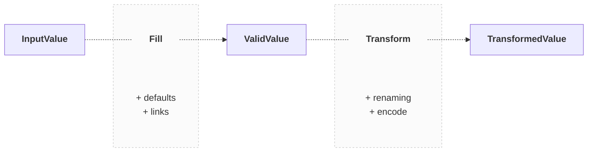
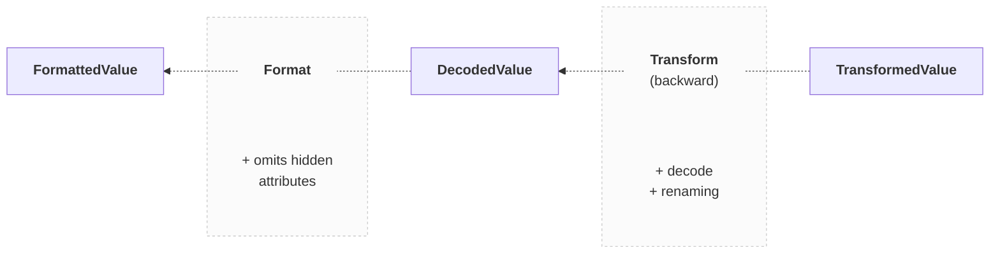

import Tabs from '@theme/Tabs';
import TabItem from '@theme/TabItem';

# Type Inference

DynamoDB-Toolbox exposes several generic types to **infer custom types** from your schemas.

Which one you should use depends on your usage context, for instance, whether it’s within a [write](#writes) or a [read](#reads) operation.

## Writes

For write operations, DynamoDB-Toolbox exposes the following generic types:

- `ValidValue`: A valid schema value
- `InputValue`: Similar to `ValidValue`, but with defaulted and linked attributes optional
- `TransformedValue`: A valid schema value after transformation



```ts
import type {
  InputValue,
  ValidValue,
  TransformedValue
} from 'dynamodb-toolbox/schema'

type Input = InputValue<typeof pokemonSchema>
type Valid = ValidValue<typeof pokemonSchema>
type Transformed = TransformedValue<typeof pokemonSchema>
```

By default, those generics use the `put` write mode, but you can switch to the `key` or `update` modes with the `mode` option. This impacts which the presence and requiredness of attributes:

```ts
type ValidKey = ValidValue<
  typeof pokemonSchema,
  { mode: 'key' }
>
type ValidUpdate = ValidValue<
  typeof pokemonSchema,
  { mode: 'update' }
>
```

:::note[Example]

Here are **step-by-step** examples:

<details className="details-in-admonition">
<summary>☝️ <b>Schema</b></summary>

```ts
const now = () => new Date().toISOString()

const pokemonSchema = item({
  // key attributes
  pokemonClass: string()
    .key()
    .transform(prefix('POKEMON'))
    .savedAs('partitionKey'),
  pokemonId: string().key().savedAs('sortKey'),

  // timestamps
  created: string().default(now),
  updated: string()
    .required('always')
    .putDefault(now)
    .updateDefault(now),

  // other attributes
  name: string().optional(),
  level: number().default(1)
}).and(prevSchema => ({
  levelPlusOne: number().link<typeof prevSchema>(
    ({ level }) => level + 1
  )
}))
```

</details>

<details className="details-in-admonition">
<summary>🔎 <b><code>'put'</code> mode</b></summary>

<Tabs>
<TabItem value="input" label="InputValue">

```diff
{
  "pokemonClass": "pikachu",
  "pokemonId": "123",
  "name": "Pikachu"
}
```

</TabItem>
<TabItem value="valid" label="ValidValue">

```diff
{
  "pokemonClass": "pikachu",
  "pokemonId": "123",
+ "created": "2022-01-01T00:00:00.000Z",
+ "modified": "2022-01-01T00:00:00.000Z",
  "name": "Pikachu",
+ "level": 1,
+ "levelPlusOne": 2,
}
```

</TabItem>
<TabItem value="transformed" label="TransformedValue">

```diff
{
- "pokemonClass": "pikachu",
+ "partitionKey": "POKEMON#pikachu",
- "pokemonId": "123",
+ "sortKey": "123",
  "created": "2022-01-01T00:00:00.000Z",
  "modified": "2022-01-01T00:00:00.000Z",
  "name": "Pikachu",
  "level": 1,
  "levelPlusOne": 2,
}
```

</TabItem>
</Tabs>

</details>

<details className="details-in-admonition">
<summary>🔎 <b><code>'key'</code> mode</b></summary>

<Tabs>
<TabItem value="input" label="InputValue">

```diff
{
  "pokemonClass": "pikachu",
  "pokemonId": "123",
}
+ (Only key attributes are required)
```

</TabItem>
<TabItem value="valid" label="ValidValue">

```diff
{
  "pokemonClass": "pikachu",
  "pokemonId": "123",
}
```

</TabItem>
<TabItem value="transformed" label="TransformedValue">

```diff
{
- "pokemonClass": "pikachu",
+ "partitionKey": "POKEMON#pikachu",
- "pokemonId": "123",
+ "sortKey": "123",
}
```

</TabItem>
</Tabs>

</details>

<details className="details-in-admonition">
<summary>🔎 <b><code>'update'</code> mode</b></summary>

<Tabs>
<TabItem value="input" label="InputValue">

```diff
{
  "pokemonClass": "bulbasaur",
  "pokemonId": "123",
  "name": "PlantyDino",
}
```

</TabItem>
<TabItem value="valid" label="ValidValue">

```diff
{
  "pokemonClass": "bulbasaur",
  "pokemonId": "123",
+ "modified": "2022-01-01T00:00:00.000Z",
  "name": "PlantyDino",
}
```

</TabItem>
<TabItem value="transformed" label="TransformedValue">

```diff
{
- "pokemonClass": "bulbasaur",
+ "partitionKey": "POKEMON#bulbasaur",
- "pokemonId": "123",
+ "sortKey": "123",
  "modified": "2022-01-01T00:00:00.000Z",
  "name": "PlantyDino",
}
```

</TabItem>
</Tabs>

</details>

:::

## Reads

For read operations, DynamoDB-Toolbox exposes the following generic types:

- `DecodedValue`: A valid schema value (differs from `ValidValue` as options are different, see below)
- `FormattedValue`: Similar to `DecodedValue`, but with `hidden` attributes omitted



```ts
import type {
  DecodedValue,
  FormattedValue
} from 'dynamodb-toolbox/schema'

type Decoded = DecodedValue<typeof pokemonSchema>
type Formatted = FormattedValue<typeof pokemonSchema>
```

By default, those generics return complete values, but you can filter attributes and/or apply `Partial` (deeply) with the `attributes` and `partial` options:

```ts
type Filtered = FormattedValue<
  typeof pokemonSchema,
  { attributes: 'level' | 'name' | 'deep.attr[0].path' }
>
type Partial = FormattedValue<
  typeof pokemonSchema,
  { partial: true }
>
```
